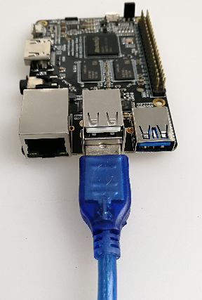

# Adb Instructions

`Adb`, short for Android Debug Bridge, is a versatile command line debugging tools, which has a variety of functions, such as tracking system logs, upload and download files, install and uninstall applications.

## Preparation

In order to use `adb`, you need to:
1. Use the male to male USB cable to connect host PC with the lower USB OTG port of the board: 
    
   
2. In Android running on the board, select `Settings` -> `USB`, and check on `Connect to PC` option.
3. Install adb driver and command, depending on your OS.

### Adb Installation in Windows

1. Install driver following [Installing RK USB Driver](flash_emmc_windows.html#installing%20rk%20usb%20driver).
2. Download [adb.zip](http://adbshell.com/upload/adb.zip), then unzip it to `C:\adb` for convenience.

Open a `cmd` window and run:

```
C:\adb\adb shell
```

You are entering the adb shell if everything goes well.

## Adb Installation in Ubuntu

1. Install adb tool：
    ```
    sudo apt-get install android-tools-adb
    ```
2. Add device ID:
    ```
    mkdir -p ~/.android
    vi ~/.android/adb_usb.ini
    # add the following line:
    0x2207
    ```
3. Add udev rules for non-root user use：
    ```
    sudo vi /etc/udev/rules.d/51-android.rules
    # add the following line：
    SUBSYSTEM=="usb", ATTR{idVendor}=="2207", MODE="0666"
    ```
4. Reload udev rules:
    ```
    sudo udevadm control --reload-rules
    sudo udevadm trigger
    ```
5. Restart adb with normal user:
    ```
    sudo adb kill-server
    adb start-server
    ```

The next you can invoke adb directly, for example:
```
adb shell
```

## Frequently Used Adb Commands

### Connection Management

List all connected devices and their serial numbers:
```
adb devices
```

If there are multiple connected devices, you need to use the serial number to distinguish them:
```
export ANDROID_SERIAL=<device serial number>
adb shell ls
```

Also adb can be connected via the tcp/ip network.
```
adb tcpip 5555
```

Adb will restart on the device side and listen on TCP port 5555.
The USB cable can be disconnected from now on.

If the IP address of the device is 192.168.1.100, you the following command to connect:
```
adb connect 192.168.1.100:5555
```

Once connected, you can run adb command as usual:
```
adb shell ps
adb logcat
```

Until you explictly disconnect adb:
```
adb disconnect 192.168.1.100:5555
```

### Debug

#### Getting System Log

Usage:
```bash
adb logcat [option] [Application label]
```

For example:
```bash
# View all logs
adb logcat

# View only part of the log
adb logcat -s WifiStateMachine StateMachine
```

#### Gathering Bug Report

`adb bugreport` is used for error reporting, which gathers useful system information.
```bash
adb bugreport

# Save to local, make it easy to use editor view
adb bugreport >bugreport.txt
```

### Running shell
Open an interactive shell:
```bash
adb shell
```

Run shell command:
```bash
adb shell ps
```

### Apk Management

#### Install Apk
```
adb install [option] example.apk

options:
-l forward-lock
-r Reinstall the application to retain the original data
-s Install to SD card instead of internal storage
```

For example:
```bash
# install facebook.apk
adb install facebook.apk

# upgrade twitter.apk
adb install -r twitter.apk
```

If install fails, check the common reasons below:
 - `INSTALL_FAILED_ALREADY_EXISTS`: Try to add `-r` parameter to install again.
 - `INSTALL_FAILED_SIGNATURE_ERROR`: APK signature is inconsistent, and it  may be due to the different version of the signature and debug version.  If you confirm the APK file signature is normal, you can use the adb uninstall command to uninstall the old application, and then install again.
 - `INSTALL_FAILED_INSUFFICIENT_STORAGE`: There is not enough storage space.

#### Uninstall Apk

```bash
adb uninstall apk_name
```

For example：
```bash
adb uninstall com.android.chrome
```

The name of the apk package can be listed with the following command:
```bash
adb shell pm list packages -f
...
package:/system/app/Bluetooth.apk=com.android.bluetooth
...
```

The apk file path and package name are separated by `=`.
