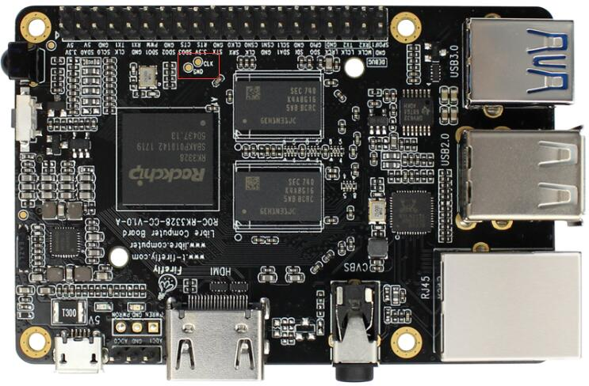

## Boot Mode

In the old days, eMMC flash is soldered directly to the board, where you have to use the onboard method to update the content.

In order to flash the firmware to the eMMC flash, a male to male USB cable is used to connect your host pc and the lower USB OTG port of the board:

Depending on the existing content of the eMMC flash, there are two boot modes: [Rockusb Mode] and [Maskrom Mode].

You usually just need to enter [Rockusb Mode] for upgrading an existing Android OS or Firefly Ubuntu OS, which is packed with Rockchip Firmware Format.

[Maskrom Mode] is the last resort when [Rockusb Mode] is not available due to bootloader damage, or you need to flash Raw Firmware to eMMC.

### Rockusb Mode

If the board powers on and finds a valid IDB (IDentity Block) in the eMMC, it will continue to load the bootloader (U-Boot is used here) in the eMMC and pass execution control to it. If the bootloader checks that the Recovery button is pressed and USB connection is made, then it enters the so-called [Rockusb Mode], waiting for further instructions from the host.

Requirement:
 - 5V2A power adapter
 - Micro USB cable to connect power adapter and board
 - Male to male USB cable to connect host PC and board
 
Steps:
 1. Pull all the USB cables (including micro USB cable and male to male USB cable) out of the board, to keep the board powering off.
 2. Plug out the SD card.
 3. Use the male to male USB cable to connect host PC with the lower USB 2.0 port of the board.
 4. Keep the RECOVERY button on the board pressed.
 5. Plug in the micro USB cable to the board.
 6. Wait about 3 seconds before releasing the RECOVERY button.

### Maskrom Mode

If anyone of the following conditions is met when the board powers on:
 - eMMC is empty.
 - The bootloader on eMMC is damaged.
 - eMMC read data failed by connecting eMMC data/clock pin to ground.
then no valid IDB (IDentity Block) will be found in the eMMC. The CPU will execute a small ROM code, waiting for the host to upload via USB a small DDR blob to initialize the DDR memory, and later a full bootloader to handle further firmware upgrading. This mode is called `Maskrom Mode`.

It involves hardware operation to force into `MaskRom Mode`, which has a certain risk and should be carried out **VERY CAREFULLY**.

Requirement:
 - 5V2A power adapter
 - Micro USB cable to connect power adapter and board
 - Male to male USB cable to connect host PC and board
 - Metal tweezers to connect eMMC clock pin to ground
 
Steps:
 1. Pull all the USB cable (including micro USB cable and male to male USB cable) cable out of the board, to keep the board powering off.
 2. Plug out the SD card.
 3. Use the male to male USB cable to connect host PC with the lower USB 2.0 port of the board.
 4. Find the reserved eMMC CLK and GND pads on the board, as shown below:

 5、Connect the eMMC CLK and GND pads with metal tweezers and keep holding steadily.
 6. Plug in the micro USB cable to the board.
 7. Wait about 1 seconds before releasing the metal tweezers.

[Rockusb Mode]: bootmode.html#rockusb-mode
[Maskrom Mode]: bootmode.html#maskrom-mode
