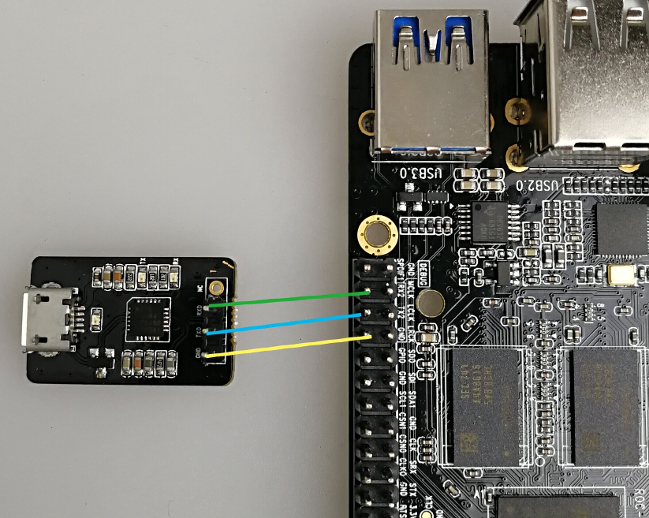
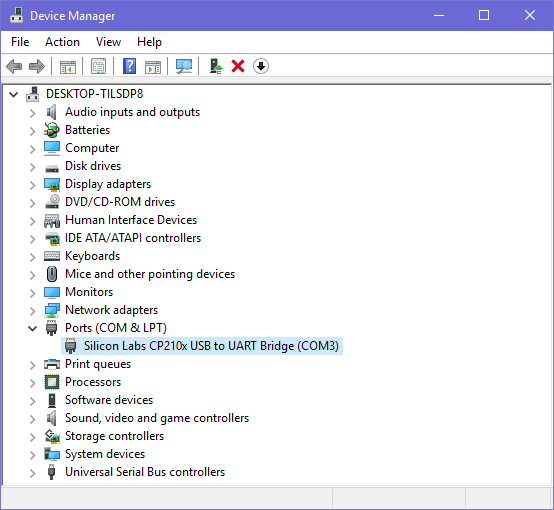
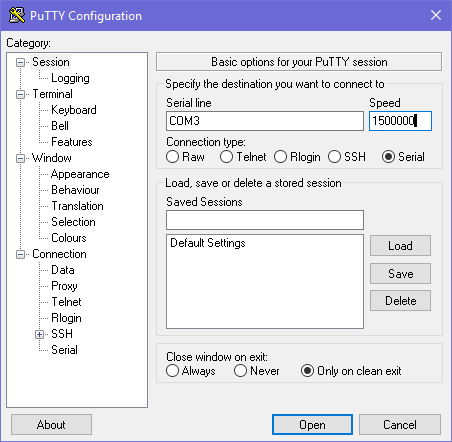

# Serial Debug

If you're doing serious U-Boot or kernel development,  a USB serial adapter (short for the USB serial TTL bridge adapter) is very useful to check the system startup log, especially in case of no graphics desktop shows up.

## Preparing USB Serial Adapter

**Choose a USB Serial Adapter**

[ROC-RK3328-CC] defaults to use **1500000** baud rate for its UART debug port, with TTL voltage.

Some adapters cannot support such high baud rate. So before purchase, make sure it meets the requirements and provides the proper driver for your OS.

You can refer to one with `CP2104` chip in the [Firefly Online Shop](http://shop.t-firefly.com/goods.php?id=32).

**Connect the Adapter to Debug Port**

Three wires are required to connect the TX/RX/GND pins together:



With some adapters, you may try to connect TX pin of the adapter to RX pin of the board, and RX pin of adapter to TX pin of the board, if you do not get the serial console working.

**Serial Parameter Setting**

[ROC-RK3328-CC] uses the following serial parameters:

- Baud rate: 1500000
- Data bit: 8
- Stop bit: 1
- Parity check: none
- Flow control: none

Next, depending on the OS you are using, we'll guide you through the detailed steps.

## Serial Debugging in Windows

**Install Driver**

Use the recommended driver from your USB serial adapter vendor. If not available, you can check the chipset and try the following drivers:
 - CH340  [🔗](http://www.wch.cn/downloads.php?name=pro&proid=5)
 - PL2303 [🔗](http://www.prolific.com.tw/US/ShowProduct.aspx?pcid=41)
 - CP210X [🔗](http://www.silabs.com/products/mcu/pages/usbtouartbridgevcpdrivers.aspx)

> If PL2303 does not work under Win8，you can try to downgrade the driver to version 3.3.5.122 or before.

After installing the driver, connect the adapter to the USB port. The OS will prompt that a new hardware is detected. When it finishes, you can find the new COM port in the device manager.



**Install Software**

There are many serial console utilities in Windows, such as putty and SecureCRT. Putty, a popular opensource software, is taken as an example here.

Download putty from [here](http://www.chiark.greenend.org.uk/~sgtatham/putty/download.html). We recommend downloading `putty.zip`, which contains other useful utilities.

Extract the archive file and run `PUTTY.exe`.

1. Select "Connection type" to "Serial".
2. Modify "Serial line" to the COM port found in the device manager.
3. Set "Speed" to 1500000.
4. Click "Open" button.



## Serial Debugging in Linux

If the chipset of the USB serial adapter is supported with Linux kernel, the driver will be loaded automatically.

Connect the serial adapter, and check the corresponding serial device file by checking:

> $ ls -l /dev/ttyUSB0 
> crw-rw---- 1 root uucp 188, 0 Apr 10 16:44 /dev/ttyUSB0

Add your Linux user to the `uucp` group, in order to have permission to access this device (or you may use `sudo` everytime):

> sudo gpasswd -a $(whoami) uucp

The group change will take effect after logout/login Linux, or use the `newgrp` command to enter a shell with the new group:

> newgrp uucp

Then proceed the following steps depending on your favor of `picocom` or `minicom`.

### picocom
    
`picocom` is light weight, easy to use.

Install it with:

> sudo apt-get install picocom

Start `picocom`:

```
$ picocom -b 1500000 /dev/ttyUSB?
picocom v3.1

port is        : /dev/ttyUSB0
flowcontrol    : none
baudrate is    : 1500000
parity is      : none
databits are   : 8
stopbits are   : 1
escape is      : C-a
local echo is  : no
noinit is      : no
noreset is     : no
hangup is      : no
nolock is      : no
send_cmd is    : sz -vv
receive_cmd is : rz -vv -E
imap is        : 
omap is        : 
emap is        : crcrlf,delbs,
logfile is     : none
initstring     : none
exit_after is  : not set
exit is        : no

Type [C-q] [C-h] to see available commands
Terminal ready
```

The messages above show that `Ctrl-a` is the escape key. Pressing `Ctrl-a Ctrl-q` will quit `picocom` and return to the shell.


### minicom

Install `minicom` with：

> sudo apt-get install minicom

Start `minicom`：

```
$ minicom
Welcome to minicom 2.7

OPTIONS: I18n
Compiled on Jan  1 2014, 17:13:19.
Port /dev/ttyUSB0, 15:57:00
                                                                                                                       
Press CTRL-A Z for help on special keys
```

Based on the above tips：Press `Ctrl-a` then `z` (not `Ctrl-z`) to bring up the Help menu.
```
+-------------------------------------------------------------------+
|                      Minicom Command Summary                      |
|                                                                   |
|              Commands can be called by CTRL-A <key>               |
|                                                                   |
|               Main Functions                  Other Functions     |
|                                                                   |
| Dialing directory..D  run script (Go)....G | Clear Screen.......C |
| Send files.........S  Receive files......R | cOnfigure Minicom..O |
| comm Parameters....P  Add linefeed.......A | Suspend minicom....J |
| Capture on/off.....L  Hangup.............H | eXit and reset.....X |
| send break.........F  initialize Modem...M | Quit with no reset.Q |
| Terminal settings..T  run Kermit.........K | Cursor key mode....I |
| lineWrap on/off....W  local Echo on/off..E | Help screen........Z |
| Paste file.........Y  Timestamp toggle...N | scroll Back........B |
| Add Carriage Ret...U                                              |
|                                                                   |
|             Select function or press Enter for none.              |
+-------------------------------------------------------------------+
```

Press `O` as prompted to enter setup screen：
```
           +-----[configuration]------+
           | Filenames and paths      |
           | File transfer protocols  |
           | Serial port setup        |
           | Modem and dialing        |
           | Screen and keyboard      |
           | Save setup as dfl        |
           | Save setup as..          |
           | Exit                     |
           +--------------------------+
```

Choose "Serial port setup", then press the upper-case letter in front of the option to set to values as illustrated below:

```
   +-----------------------------------------------------------------------+
   | A -    Serial Device      : /dev/ttyUSB0                              |
   | B - Lockfile Location     : /var/lock                                 |
   | C -   Callin Program      :                                           |
   | D -  Callout Program      :                                           |
   | E -    Bps/Par/Bits       : 1500000 8N1                               |
   | F - Hardware Flow Control : No                                        |
   | G - Software Flow Control : No                                        |
   |                                                                       |
   |    Change which setting?                                              |
   +-----------------------------------------------------------------------+
```

Note:
* Hardware Flow Control and Software Flow Control should be set to No.
* After finishing the setting, go back to the previous menu by pressing `ESC`, and select "Save setup as dfl" to save as the default configuration.

[ROC-RK3328-CC]: http://en.t-firefly.com/product/rocrk3328cc.html "ROC-RK3328-CC Official Website"
