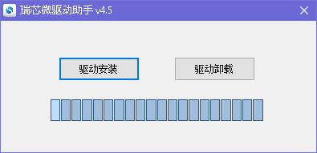
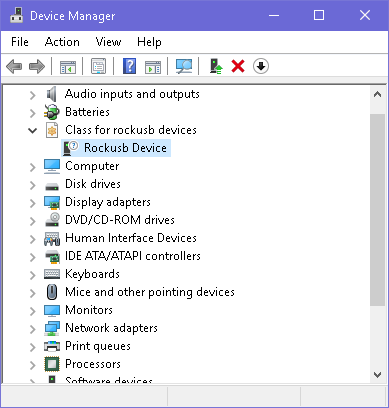
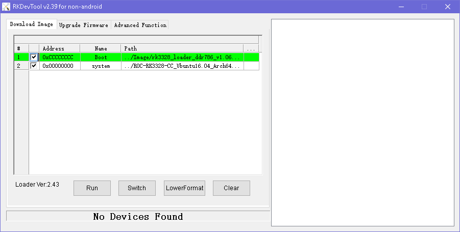
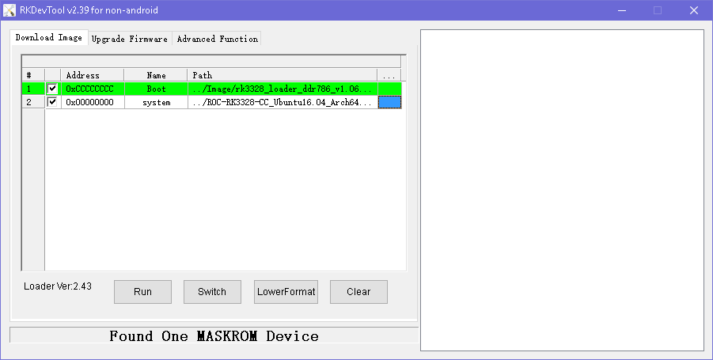
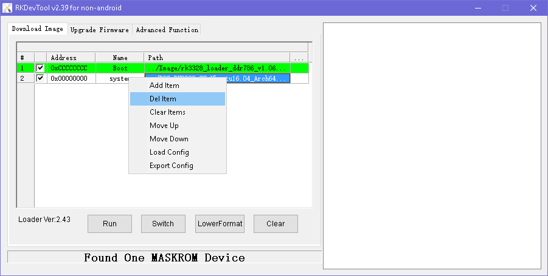
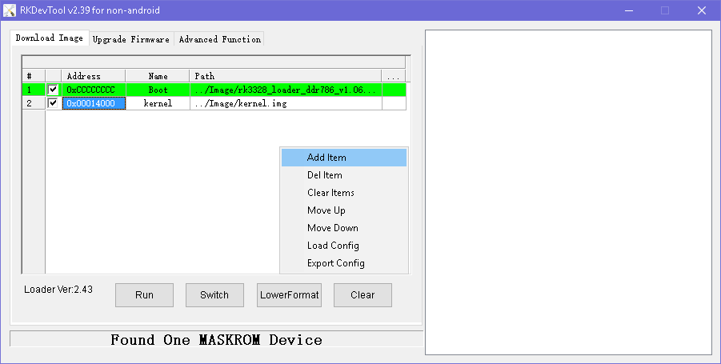

# Flashing to eMMC in Windows

`AndroidTool` is used to flash firmware and partition images to eMMC storage in Windows.

To use `AndroidTool`, you need to install `Rockusb Driver` first.

## Installing Rockusb Driver

Download [DriverAssistant], extract the archive and run `DriverInstall.exe` inside.



Click the "驱动安装" button to install the driver. If you want to uninstall the driver, click the "驱动卸载" button.

If your device is in [Rockusb Mode] or [Maskrom Mode], you'll find a `Rockusb Device` in the device manager:



## Installing AndroidTool

Download [AndroidTool], extract it. Locate the file named `config.ini`, and edit it by changing the 4th line from `Selected=1` to `Selected=2`, in order to select English as the default user interface.

Launch `AndroidTool.exe`:



If your device is in [Rockusb Mode], the status line will be "Found One LOADER Device".

If your device is in [Maskrom Mode], the status line will be "Found One MASKROM Device".

## Flashing Raw Firmware

Raw firmware needs to be flashed to offset 0 of eMMC storage. However, in [Rockusb Mode], you cannot do this because all LBA writes are offset by 0x2000 sectors. Therefore, the device has to be forced into [Maskrom Mode].

After installation of `Rockusb Driver` and `AndroidTool`, the steps of flashing raw firmware are:

1. Force the device into [Maskrom Mode].
2. Run `AndroidTool`.
3. Switch to the `Download Image` tab page.
4. Keep the first line of the table unchanged, using the default `MiniLoader` bin.
5. Click the right blank cell on the second line, which will pop up a file dialog to open the raw firmware file.
6. Click "Run" button to flash.



## Flashing Rockchip Firmware

After installation of `Rockusb Driver` and `AndroidTool`, the steps of flashing Rockchip firmware are:

1. Force the device into [Rockusb Mode] or [Maskrom Mode].
2. Run `AndroidTool`.
3. Switch to the `Upgrade Firmware` tab page.
4. Click the "Firmware" button, which will pop up a file dialog to open the Rockchip firmware file.
5. Firmware version, loader version and chip info will be read and displayed. 
6. Click "Upgrade" button to flash.

## Flashing Partition Image

After installation of `Rockusb Driver` and `AndroidTool`, the steps of flashing partition image are:

1. Force the device into [Rockusb Mode] or [Maskrom Mode].
2. Run `AndroidTool`.
3. Switch to the `Download Image` tab page.
4. Keep the first line of the table unchanged.
5. Delete all others unused rows by selecting "Delete Item" from the right-click popup menu.
   
6. Add partition image to flash by selection "Add Item" from the right-click popup menu.
    * Check on the checkbox on the first cell.
    * Fill in the address with the sector offset (plus `0x2000` if in [Maskrom Mode]) of partition in `parameter.txt` file.
    * Click the right blank cell to browse to the partition image file.
   
7. Click "Run" button to flash.

**Note**:
- You can add multiple partitions to flash by repeating step 6.
- You can skip the partition flashing by checking off the checkbox in front of the address cell.
- In [Maskrom Mode], you must add `0x2000` to the sector offset of the partition in `parameter.txt`.

For convenience, see next chapter to find out the offsets easily.

## Partition Offsets

Here's a handy script to list the partition offsets in `parameter.txt`:
```
#!/bin/sh

PARAMETER_FILE="$1"
[ -f "$PARAMETER_FILE" ] || { echo "Usage: $0 <parameter_file>"; exit 1; }

show_table() {
	echo "$1"
	echo "--------"
	printf "%-20s %-10s %s\n" "NAME" "OFFSET" "LENGTH"
	for PARTITION in `cat ${PARAMETER_FILE} | grep '^CMDLINE' | sed 's/ //g' | sed 's/.*:\(0x.*[^)])\).*/\1/' | sed 's/,/ /g'`; do
		NAME=`echo ${PARTITION} | sed 's/\(.*\)(\(.*\))/\2/'`
		START=`echo ${PARTITION} | sed 's/.*@\(.*\)(.*)/\1/'`
		LENGTH=`echo ${PARTITION} | sed 's/\(.*\)@.*/\1/'`
		START=$((START + $2))
		printf "%-20s 0x%08x %s\n" $NAME $START $LENGTH
	done
}

show_table "Rockusb Mode" 0
echo
show_table "Maskrom Mode" 0x2000
```

Save it as a script in `/usr/local/bin/show_rk_parameter.sh` and give the script executing permission.

Here's an example of showing partition offsets defined in `RK3328 Android SDK`:
```
$ show_rk_parameter.sh device/rockchip/rk3328/parameter.txt 
Rockusb Mode
--------
NAME                 OFFSET     LENGTH
uboot                0x00002000 0x00002000
trust                0x00004000 0x00004000
misc                 0x00008000 0x00002000
baseparamer          0x0000a000 0x00000800
resource             0x0000a800 0x00007800
kernel               0x00012000 0x00010000
boot                 0x00022000 0x00010000
recovery             0x00032000 0x00010000
backup               0x00042000 0x00020000
cache                0x00062000 0x00040000
metadata             0x000a2000 0x00008000
kpanic               0x000aa000 0x00002000
system               0x000ac000 0x00300000
userdata             0x003ac000 -

Maskrom Mode
--------
NAME                 OFFSET     LENGTH
uboot                0x00004000 0x00002000
trust                0x00006000 0x00004000
misc                 0x0000a000 0x00002000
baseparamer          0x0000c000 0x00000800
resource             0x0000c800 0x00007800
kernel               0x00014000 0x00010000
boot                 0x00024000 0x00010000
recovery             0x00034000 0x00010000
backup               0x00044000 0x00020000
cache                0x00064000 0x00040000
metadata             0x000a4000 0x00008000
kpanic               0x000ac000 0x00002000
system               0x000ae000 0x00300000
userdata             0x003ae000 -
```


[AndroidTool]: http://www.t-firefly.com/share/index/listpath/id/acd8e1e37176fba5bf61fb7bf4503998.html
[DriverAssistant]: https://pan.baidu.com/s/1migPY1U#list/path=%2FPublic%2FDevBoard%2FROC-RK3328-CC%2FTools%2FRKTools%2Fwindows&parentPath=%2FPublic%2FDevBoard%2FROC-RK3328-CC
[Rockusb Mode]: bootmode.html#rockusb-mode
[Maskrom Mode]: bootmode.html#maskrom-mode
