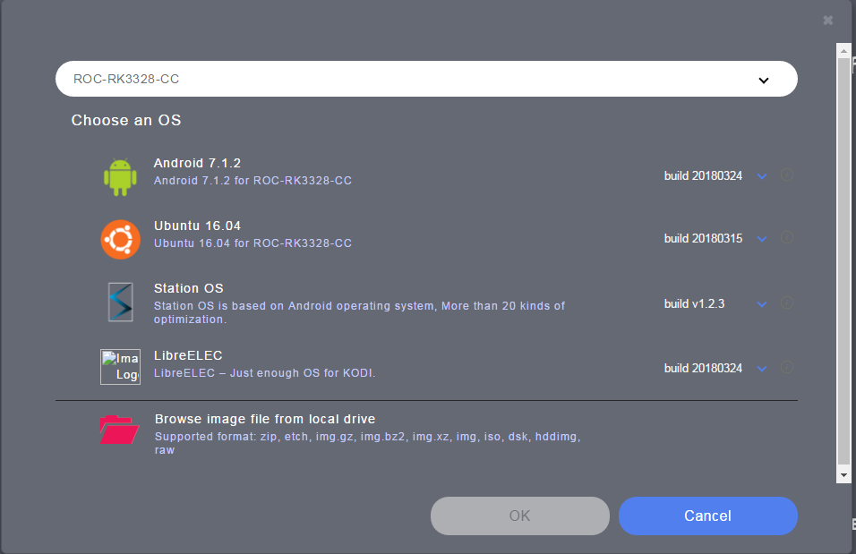
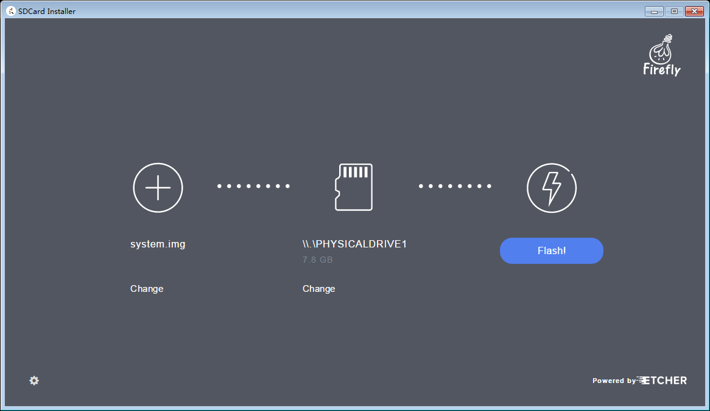
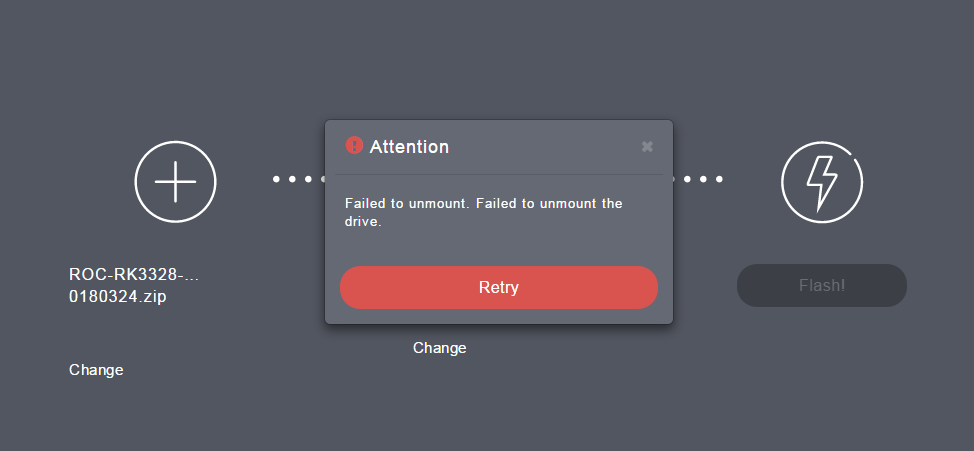
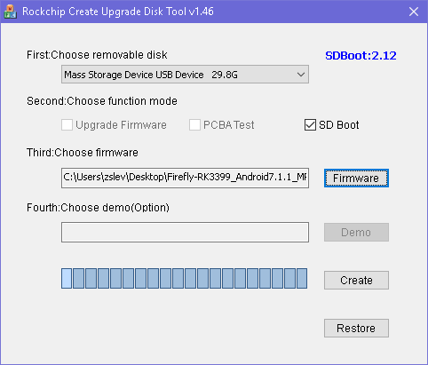
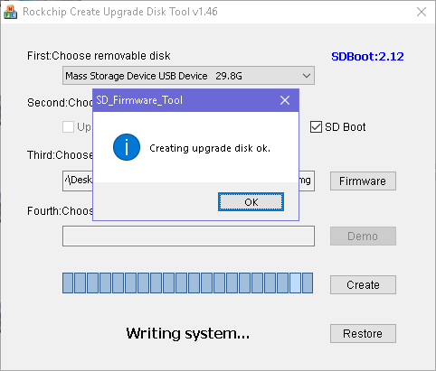

# Flashing to SD Card in Windows

## Flashing Raw Firmware

The easiest way to flash raw firmware in Windows is to use the official [SDCard Installer], a handy firmware flashing tool derived from [Etcher].

The [SDCard Installer] will save time to search for available firmware for your device. You just need to select the device, choose firmware, plugin in the SD card, and finally click the flash button, which is simple and straightforward:

1. Run [SDCard Installer].
2. Click the "Choose an OS" button, and select "ROC-RK3328-CC" in the "Please select your device" combo box. A list of available firmware is updated from the network and presented to you, as illustrated below:

4. Choose an OS, and click "OK" button. You can also select the image file from your local drive, rather than downloading from the network.
5. Plug in the SD card.
6. Clicks the "Flash!" button, and wait.

**Note**: Sometimes, when the progress reaches to 99% or 100%, an error of unmounting the SD card may occur, which can be ignored and does no harm to the data flashed to the SD card.

 
## Flashing Rockchip Firmware

This section is about flashing Rockchip format firmware to SD card.

First, you will need to download and install the [SD_Firmware_Tool].

After extraction, in the directory of [SD_Firmware_Tool], edit `config.ini` by changing the 4th line from `Selected=1` to `Selected=2`, in order to select English as the default user interface.

Run `SD_Firmware_Tool.exe`:

1. Plug in the SD card.
2. Select the SD card from the combo box.
3. Check on the "SD Boot" option.
4. Click "Firmware" button, and select the firmware in the file dialog.  
5. Click "Create" button.
6. A warning dialog will show up. By making sure you have the right SD card device selected, select "Yes" to continue.
7. Wait for the operation to complete, until the info dialog shows up.

8. Plug out the SD card.

[Etcher]: https://etcher.io
[SD_Firmware_Tool]: https://pan.baidu.com/s/1migPY1U#list/path=%2FPublic%2FDevBoard%2FROC-RK3328-CC%2FTools%2FSD_Firmware_Tool&parentPath=%2FPublic%2FDevBoard%2FROC-RK3328-CC
[AndroidTool]: https://pan.baidu.com/s/1migPY1U#list/path=%2FPublic%2FDevBoard%2FROC-RK3328-CC%2FTools%2FAndroidTool&parentPath=%2FPublic%2FDevBoard%2FROC-RK3328-CC
[SDCard Installer]: http://www.t-firefly.com/share/index/index/id/acd8e1e37176fba5bf61fb7bf4503998.html
[DriverAssistant]: https://pan.baidu.com/s/1migPY1U#list/path=%2FPublic%2FDevBoard%2FROC-RK3328-CC%2FTools%2FRKTools%2Fwindows&parentPath=%2FPublic%2FDevBoard%2FROC-RK3328-CC
