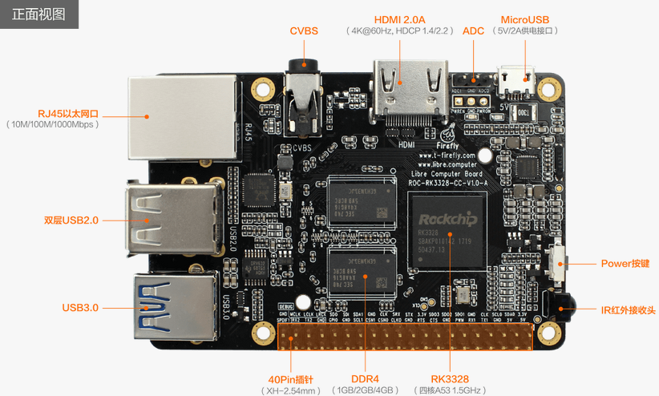

# Firmware and Tools
Tools:
 - [Etcher](https://etcher.io)
 - [SD_Firmware_Tool](https://pan.baidu.com/s/1migPY1U#list/path=%2FPublic%2FDevBoard%2FROC-RK3328-CC%2FTools%2FSD_Firmware_Tool&parentPath=%2FPublic%2FDevBoard%2FROC-RK3328-CC)
 - [AndroidTool](https://pan.baidu.com/s/1migPY1U#list/path=%2FPublic%2FDevBoard%2FROC-RK3328-CC%2FTools%2FAndroidTool&parentPath=%2FPublic%2FDevBoard%2FROC-RK3328-CC)
 - [DriverAssistant](https://pan.baidu.com/s/1migPY1U#list/path=%2FPublic%2FDevBoard%2FROC-RK3328-CC%2FTools%2FRKTools%2Fwindows&parentPath=%2FPublic%2FDevBoard%2FROC-RK3328-CC)

# Documents and Reference

 - [Partition and Storage Map](http://opensource.rock-chips.com/wiki_Partitions)

# Hardware Datasheets and Interfaces

Datasheets:
 - [ROC-RK3328-CC Schematic](http://www.t-firefly.com/download/ROC-RK3288-CC/ROC-RK3328-CC-V1.0-A_yl.pdf)
 - [ROC-RK3328-CC Components Position Reference](http://www.t-firefly.com/download/ROC-RK3288-CC/ROC-RK3328-CC-V1.0-A_tp.pdf)
 - [Rockchip RK3328 Datasheet](http://www.t-firefly.com/download/ROC-RK3288-CC/Rockchip%20RK3328%20Datasheet%20V1.0-20170117.pdf)
 - [Rockchip RK805 Datasheet V1.1](http://files.pine64.org/doc/rock64/Rockchip_RK805_Datasheet_V1.1%C2%A020160921.pdf)

Expansion Interface:

Board Top:

Board Bottom:

# Community
Firefly:
- [Forum](http://bbs.t-firefly.com/)
- [Facebook](https://www.facebook.com/TeeFirefly)
- [Google+](https://plus.google.com/u/0/communities/115232561394327947761)
- [Youtube](https://www.youtube.com/channel/UCk7odZvUrTG0on8HXnBT7gA)
- [Twitter](https://twitter.com/TeeFirefly)
- [Shop](http://shop.t-firefly.com/)
